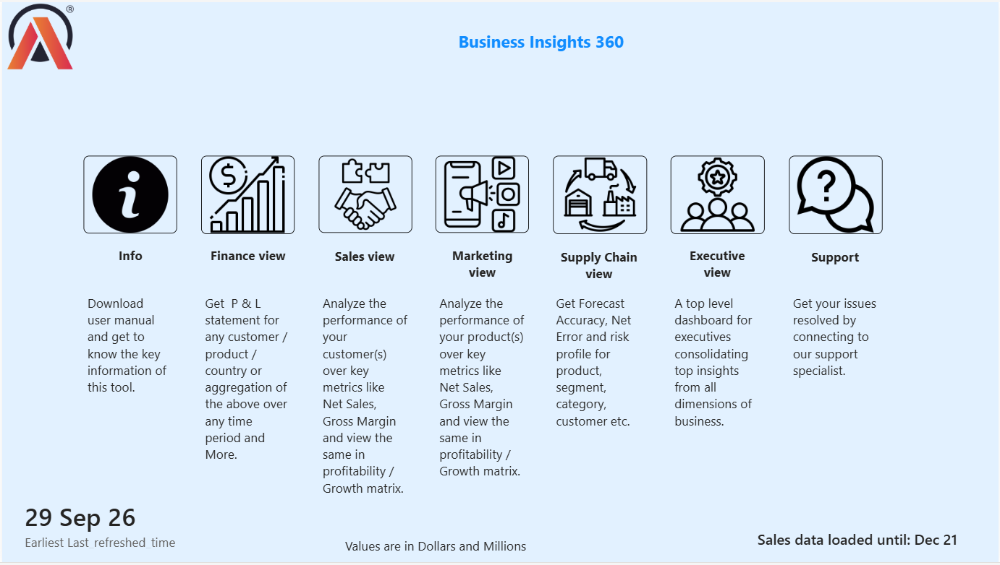
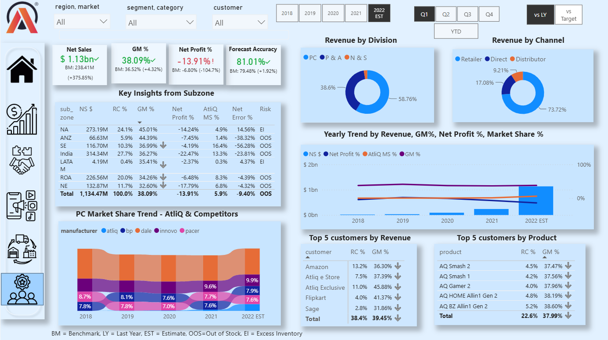
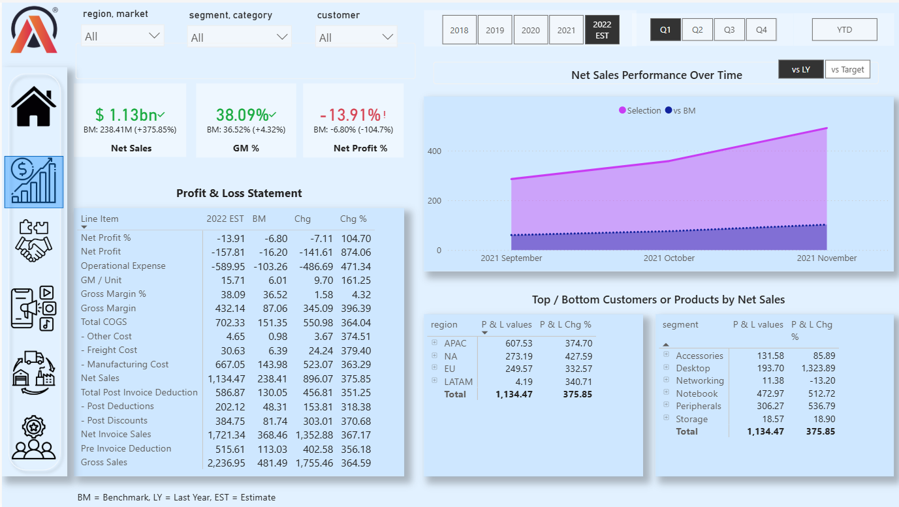
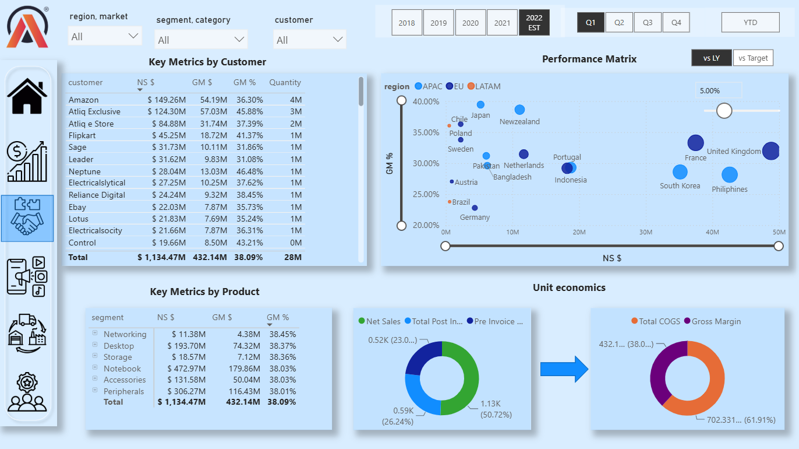
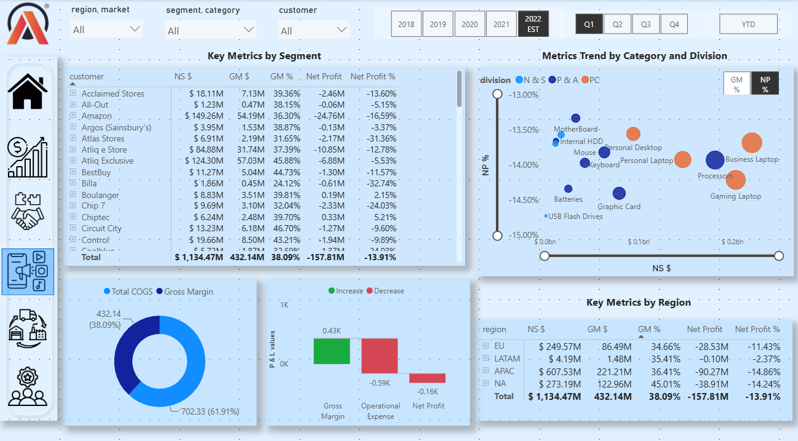
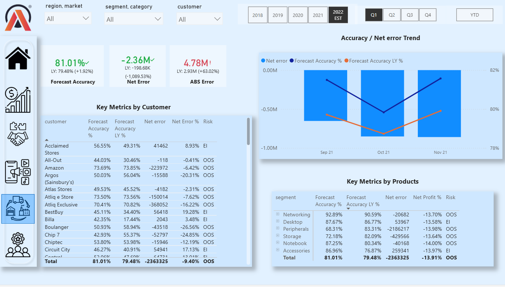

# Business Insights 360 — Power BI

An end-to-end Power BI business intelligence solution that connects Finance, Sales, Marketing, Supply Chain, and Executive reporting through one analytical model.



## What I worked on

I built a cross-functional reporting solution for the AtliQ Hardware business case. The project brings actual sales, forecasts, costs, operational expenses, targets, and market-share data together so decision-makers can move from a high-level KPI to the customer, product, market, or operational driver behind it.

My work covered:

- Designing a shared semantic model for cross-functional analysis
- Building a dynamic Profit and Loss statement from Gross Sales to Net Profit
- Creating Finance, Sales, Marketing, Supply Chain, and Executive analytical views
- Developing reusable DAX measures for profitability, forecasting, risk, and benchmarking
- Connecting an AI assistant to Power BI through the Microsoft Power BI Authoring MCP Server for model discovery and DAX authoring
- Supporting last-year and target comparisons through dynamic benchmark selection
- Measuring visual performance with Power BI Performance Analyzer
- Investigating generated DAX queries with DAX Studio

## Proof of work

| Area | Implementation proof |
| --- | --- |
| Semantic model | 29 tables, 127 columns, 65 measures, and 28 relationships supporting actuals, forecasts, costs, targets, and market share |
| Financial logic | Dynamic P&L reporting, explicit operating-expense sign handling, Gross Margin, and Net Profit calculations |
| Forecasting | Absolute error, Forecast Accuracy, net error, and OOS/EI risk classification |
| Benchmarking | Reusable last-year and target comparisons across Net Sales, Gross Margin %, Net Profit %, and P&L reporting |
| Performance analysis | A selected table visual was profiled at approximately 2.69 seconds total, including a 1.25-second DAX query |
| Dashboard experience | Home navigation plus dedicated Executive, Finance, Sales, Marketing, and Supply Chain views |
| AI-assisted development | Used the Microsoft Power BI Authoring MCP Server in VS Code to inspect the open semantic model, retrieve DAX definitions, and accelerate measure creation from natural-language requirements |
| Technical documentation | Detailed explanations of the [semantic model](docs/semantic-model.md), [DAX patterns](docs/dax-highlights.md), and [performance workflow](docs/performance-optimization.md) |

## How I used AI in this project

I connected an AI assistant in VS Code to my open Power BI Desktop project through the **Microsoft Power BI Authoring MCP Server**. This gave the assistant structured access to the semantic-model metadata and enabled a practical AI-assisted development workflow inside the tools I was already using.


I used this workflow to:

- **Explore and document the model:** query the open Power BI project and produce an inventory of **29 tables, 127 columns, 65 measures, and 28 relationships** without manually reviewing every model object
- **Inspect existing logic:** retrieve measure names and DAX definitions to understand, document, and troubleshoot calculations more quickly
- **Accelerate DAX authoring:** describe a business calculation in natural language—such as Net Margin—and use the assistant to generate and write the corresponding DAX measure through the connected authoring server
- **Reduce repetitive work:** automate model discovery and routine measure scaffolding so more time could be spent on business logic, report design, and analytical interpretation
- **Maintain analytical quality:** validate AI-assisted measures against the intended business definition, filter context, formatting, and report results before using them in the dashboard

This demonstrates more than prompting an AI chatbot: I integrated an AI assistant with the Power BI authoring environment, used model-aware context, and combined automation with human validation. The same approach can support faster semantic-model audits, DAX development, documentation, and maintenance in industry-scale BI projects.

## Key business insights — 2022 estimate, Q1

- Net Sales reached **$1.13B** and Gross Margin was **38.09%**, while Net Profit remained negative at **-13.91%**. The result shows why revenue growth must be evaluated alongside operating expenses and final profitability.
- Forecast Accuracy improved to **81.01%** from **79.48%** last year, but the **-2.36M net error** produced an overall **OOS** risk signal. Higher aggregate accuracy did not eliminate under-forecasting exposure.
- **APAC generated $607.53M** in Net Sales, the largest regional contribution, while **North America delivered the strongest Gross Margin rate at 45.01%**.
- **Notebook was the largest product segment**, generating **$472.97M** in Net Sales and **$179.86M** in Gross Margin.
- The Retailer channel contributed **73.72%** of revenue, compared with **17.08%** from Direct and **9.21%** from Distributor channels.

## Functionalities implemented

### Executive reporting

- Consolidated cross-functional KPIs into a management view
- Enabled movement from company-level performance into functional analysis
- Combined Net Sales, profitability, Forecast Accuracy, and Market Share context
- Supported last-year and target-based performance comparison



### Finance analytics

- Structured the P&L from Gross Sales through Net Profit
- Incorporated pre-invoice and post-invoice deductions
- Connected manufacturing, freight, and operating-expense inputs to profitability
- Enabled market, customer, product, and period-level variance analysis



### Sales analytics

- Compared customer, product, and market contribution
- Evaluated revenue contribution alongside Gross Margin contribution
- Supported top and bottom performer investigation
- Preserved consistent benchmark context across drill-downs



### Marketing analytics

- Analyzed performance across division, segment, category, product, and geography
- Distinguished revenue growth from profitable growth
- Connected product and market performance with Gross Margin and Net Profit
- Supported portfolio and regional performance analysis



### Supply-chain analytics

- Compared actual sales with forecast quantities
- Calculated absolute forecast error and Forecast Accuracy
- Used net-error direction to classify potential Out-of-Stock and Excess Inventory risk
- Enabled customer and product-level forecast investigation



## Selected DAX proof

### Operating expenses and Net Profit

```DAX
Operational Expense $ =
([Ads & Promotions] + [Other Operational Expense]) * -1

Net Profit =
[GM $] + [Operational Expense $]
```

Operating expenses are represented as negative values. Adding the expense measure to Gross Margin is therefore mathematically equivalent to subtracting operating expenses.

### Forecast Accuracy and inventory risk

```DAX
ABS Error % =
DIVIDE([ABS Error], [Forecast quantity], 0)

Forecast Accuracy % =
IF(
    [ABS Error %] <> BLANK(),
    1 - [ABS Error %],
    BLANK()
)

Risk =
IF(
    [Net error] < 0,
    "OOS",
    IF([Net error] > 0, "EI", BLANK())
)
```

Forecast Accuracy measures the magnitude of the miss, while the Risk measure identifies its operational direction.

## Knowledge gained

### Business and domain knowledge

- How sales deductions, product costs, and operating expenses flow through a P&L
- Why high revenue does not necessarily mean strong profitability
- How sales contribution and margin contribution can tell different stories
- How Forecast Accuracy and error direction support inventory decisions
- How targets, prior-year performance, and Market Share answer different management questions

### Power BI and analytical engineering

- Designing a reusable semantic model around shared dimensions
- Managing filter context across multiple business functions
- Building reusable DAX instead of embedding logic in individual visuals
- Combining financial values and percentages in a dynamic reporting structure
- Designing drill-down paths from executive KPIs to operational detail
- Using Performance Analyzer and DAX Studio to investigate slow visuals and queries

### Analytical communication

- Translating stakeholder questions into KPIs and report views
- Explaining financial sign conventions and calculation logic clearly
- Separating forecast-error magnitude from operational-risk direction
- Presenting technical implementation in business language

## How I can apply this to industry projects

| Industry responsibility | Capability demonstrated in this project |
| --- | --- |
| Requirements discovery | Convert Finance, Sales, Marketing, Supply Chain, and Executive questions into analytical requirements |
| Data modeling | Design shared dimensions and facts that support consistent cross-functional reporting |
| KPI governance | Centralize business definitions in reusable measures and maintain consistent filter behavior |
| Financial analytics | Build P&L logic, profitability measures, variance analysis, and management benchmarks |
| Forecast analytics | Measure forecast quality and translate error direction into operational risk |
| Dashboard development | Create role-specific views with clear navigation and drill-down paths |
| Performance engineering | Profile visuals, inspect DAX execution, identify optimization opportunities, and retest changes |
| Stakeholder communication | Explain findings, assumptions, calculations, and technical trade-offs in business terms |
| Documentation and handover | Document model design, DAX patterns, and performance workflows for maintainability |

This foundation can be applied to industry projects involving revenue and profitability reporting, commercial performance, demand planning, inventory management, target tracking, and executive decision support.

## Technical highlights

- Power BI semantic modeling
- DAX measures and dynamic reporting logic
- Financial and profitability analysis
- Forecast Accuracy and risk classification
- Dynamic benchmarking
- Power BI Performance Analyzer
- DAX Studio Server Timings and Query Plans
- Business-facing technical documentation

## Repository guide

```text
business-insights-360-powerbi/
├── README.md
├── assets/
│   └── screenshots/
│       ├── executive-view.png
│       ├── finance-view.png
│       ├── marketing-view.png
│       ├── power-bi-authoring-mcp.png
│       ├── report-home.png
│       ├── sales-view.png
│       └── supply-chain-view.png
├── docs/
│   ├── dax-highlights.md
│   ├── performance-optimization.md
│   └── semantic-model.md
└── .gitignore
```

- [Semantic model](docs/semantic-model.md) — model architecture and analytical table groups
- [DAX highlights](docs/dax-highlights.md) — profitability, forecasting, risk, and benchmark logic
- [Performance optimization](docs/performance-optimization.md) — Performance Analyzer and DAX Studio workflow

## Project context

AtliQ Hardware is a fictional business case used to demonstrate cross-functional analytics. This repository documents my Power BI implementation, including semantic modeling, DAX measures, report functionality, analytical reasoning, and performance analysis.

The Power BI `.pbix` file and source dataset are not distributed in this repository.
